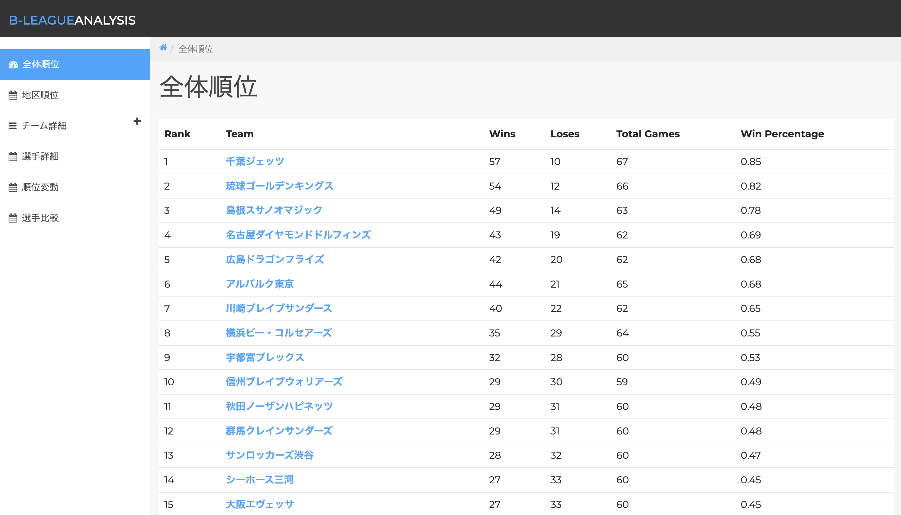
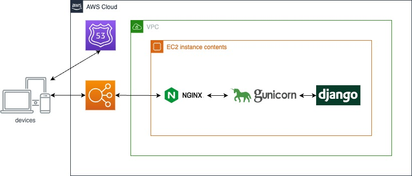

# バスケットボール分析サイト

## 概要

このリポジトリは、バスケットボールの試合結果や選手のパフォーマンスに関するデータを分析するウェブサイトのソースコードです。Djangoフレームワークを基に開発されており、ユーザーフレンドリーなインターフェースと強力なデータ分析ツールを提供します。このアプリケーションはAWS EC2上で運用され、Gunicornとnginxを使用してホストされています。ドメイン管理にはAmazon Route 53を使用しています。

## 目次

- [必要条件](#必要条件)
- [使用言語、環境、テクノロジー](#使用言語環境テクノロジー)
- [システム構成図](#システム構成図)
- [使い方](#使い方)
- [こだわりポイント](#こだわりポイント)
- [今後の計画](#今後の計画)

## 必要条件

- ブラウザ (推奨: 最新のChrome)
- インターネット接続

## 使用言語、環境、テクノロジー

- Python 3.9
- Django
- AWS EC2
- Gunicorn
- nginx
- Amazon Route 53
- OpenAI's ChatGPT

## システム構成図

## 使い方

サイトは以下のURLからアクセス可能です:

[https://bleague-dashboard.com/](https://bleague-dashboard.com/)

- **全体順位**: 全体の順位を確認できます。勝数、負数、試合数、勝率を確認できます。
- **地区順位**: 各地区での順位を確認できます。
- **チーム詳細**: 各チームのデータを分析可能です。得点・失点の推移を確認できます。
- **選手詳細**: 各選手のデータを分析可能です。
- **順位変動**: 順位の変動を確認可能です。
- **選手比較**: 各選手のデータを比較分析可能です。

## こだわりポイント

- **ChatGPTを用いたコーティング**: フロントエンドにChatGPTを活用していることで、正確で素早いコーティングを実施。

- **分析観点**: Bleagueの公式サイトではできない、分析観点から分析が可能です。

## 今後の計画

- **より詳細な選手情報**: 選手のパフォーマンスデータをより詳細に提供するための機能を追加予定です。
- **Docker化**: 自身の勉強のためにDocker化を行う。
- **Actionsの利用**: 自動テストや自動ビルドがGitHubだけで実現できるようにする。
